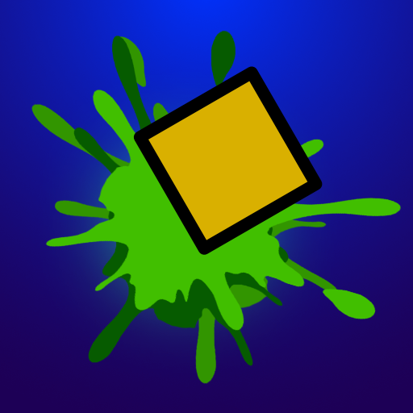
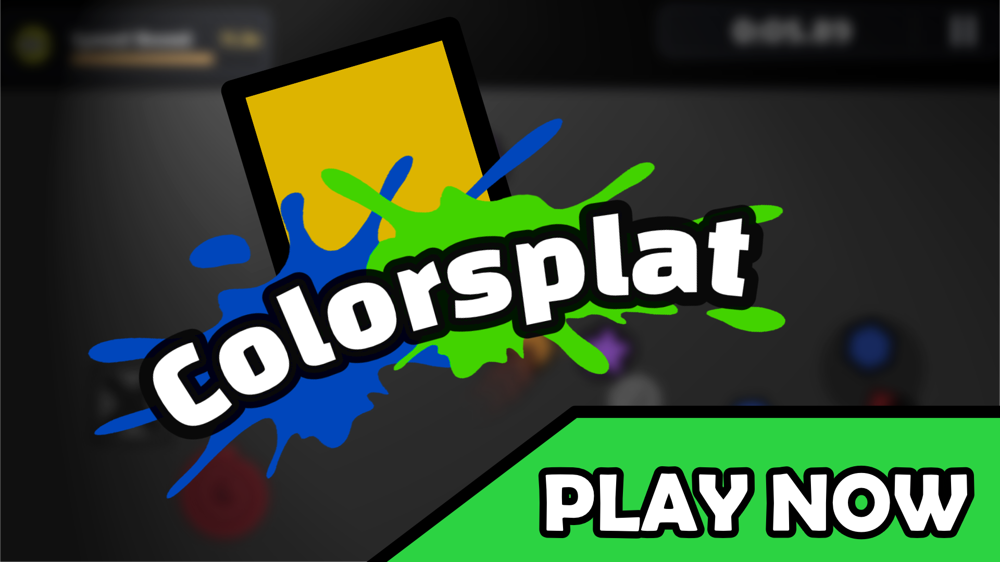
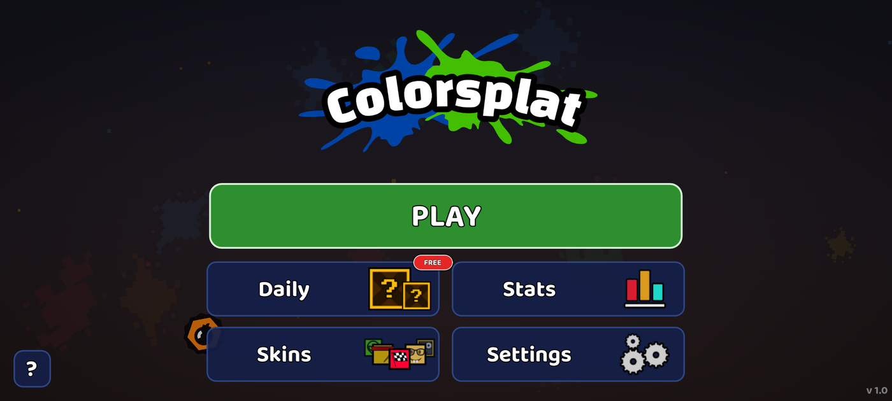
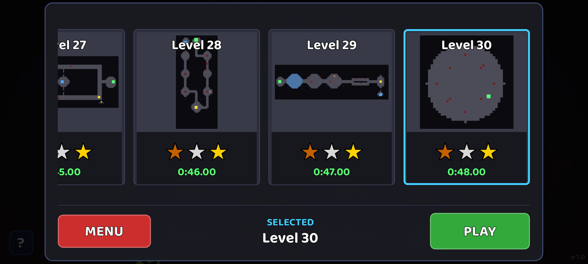
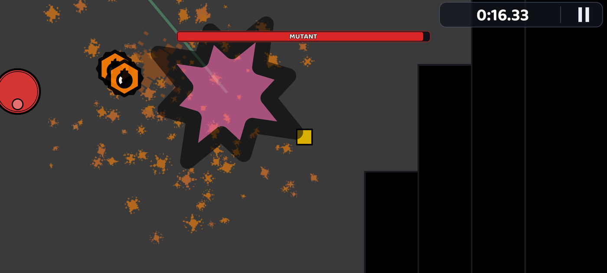
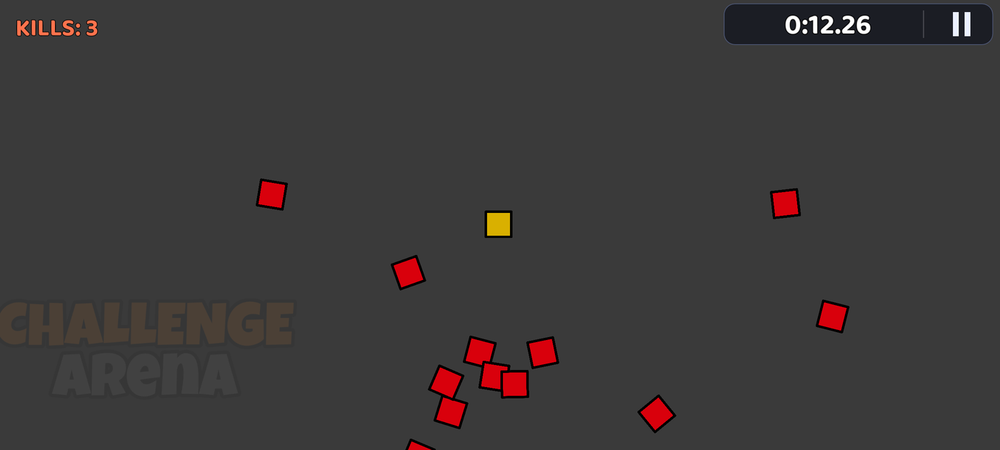
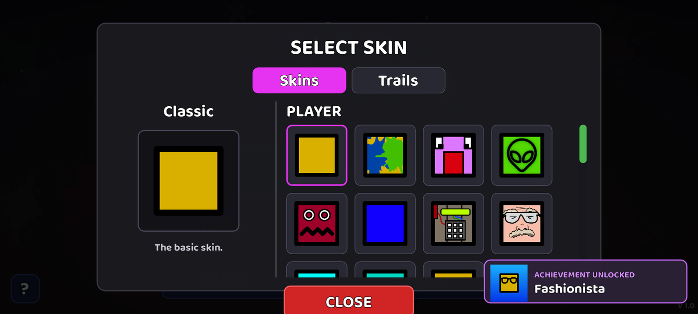
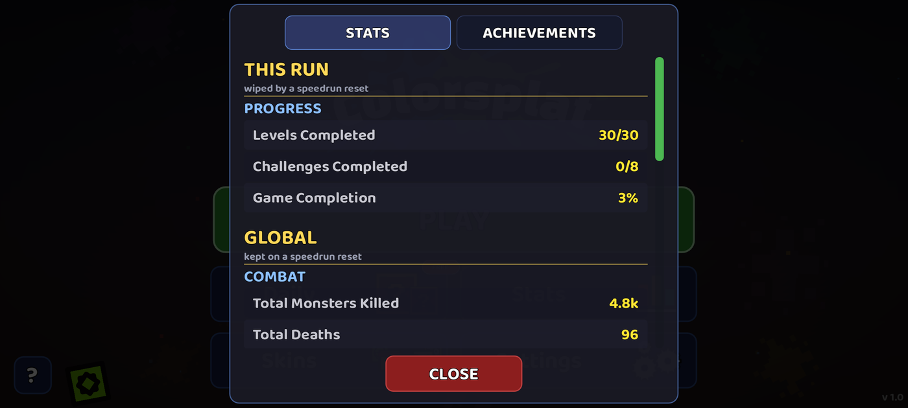

<div align="center">



# ColorSplat!

**A twin-stick paint shooter for Android — made in Godot 4.**

Move with one thumb, shoot with the other. Everything you kill splatters paint,
and paint that isn't yours slows you down.

[](https://godotengine.org)
[](scripts/)
[](#build-it-for-android)
[](LICENSE)



</div>

---

## Screenshots

<table>
<tr>
<td width="50%"><br><sub><b>Main menu</b> — all UI and art drawn by me</sub></td>
<td width="50%"><br><sub><b>30 levels</b> with auto-generated minimaps and star times</sub></td>
</tr>
<tr>
<td><br><sub><b>Boss fight</b> in level 30 — paint everywhere</sub></td>
<td><br><sub><b>Challenge arena</b> — endless swarm, grenades only</sub></td>
</tr>
<tr>
<td><br><sub><b>32 skins and 26 trails</b>, every one hand-drawn</sub></td>
<td><br><sub><b>Stats and 31 achievements</b>, tracked across sessions</sub></td>
</tr>
</table>

## The game

You're a yellow square in a dark arena. Monsters come at you, you shoot them, and each
one bursts into a splat of its own colour. That paint stays on the floor — walk through
someone else's and you crawl at 40 % speed, so the mess you're making is also the trap
you're building for yourself.

**Three ways to play:**

- **Levels** — 30 hand-built levels with waves, turrets, saws, ice, keys and locked doors.
  Beat one fast enough and you get up to three stars.
- **Endless** — one arena, monsters keep coming, it gets harder for seven minutes straight.
  How long can you last?
- **Challenges** — 8 special runs with a twist each: fight in the dark, only grenades,
  a tiny arena, one hit and you're out.

Along the way: a daily loot box, 31 achievements, 32 skins and 26 paint trails to unlock,
and menus in 5 languages (English, Czech, Spanish, German, French).

**What's in it:** 8 enemy types (from basic grunts to a healer, a splitter and a phantom
that phases in and out), 9 power-ups, 5 usable items, 26 different level objects, and a
boss.

## Made by me

Everything you see is my own work:

- **All the graphics.** 187 SVG files — the player, every monster, every skin and trail,
  every level object, all the icons, the menus, the logo and the app icon. Drawn by me
  for this game, nothing bought and nothing borrowed.
- **All the code.** ~24 700 lines of GDScript across 84 files: gameplay, UI, save system,
  achievements, localization, shaders.
- **All the levels.** 30 levels and 8 challenge arenas, laid out and tuned by hand.
- **The audio.** Music and sound effects generated with AI tools, then picked, cut and
  put together by me.

## How it's built

A quick tour for anyone who wants to look at the code:

```
scripts/
  autoload/   5 always-on managers: game state, saves, audio, achievements, ads
  game/       the gameplay — player, monsters, bullets, paint, items, power-ups
    level/    26 level objects: turrets, pistons, keys, doors, hazards…
  ui/         menus, HUD, popups, the virtual joystick
  data/       the "tables": enemy stats, level waves, achievements, skins, trails
  utils/      maths, screen-shake, localization, theming
scenes/
  levels/     30 levels        challenges/  8 challenge arenas
assets/
  sprites/    187 SVGs         audio/       music + sound effects
  shaders/    5 shaders        fonts/       Google Fonts (OFL)
```

A few bits I'm happy with:

- **The paint.** The floor is one big canvas that everything gets stamped into, so a
  thousand splats cost the same as one. Whether you're standing in paint is tracked on a
  simple grid instead of reading pixels back from the GPU — that one change is what made
  it run smoothly on a phone.
- **Enemies as data.** All 8 types come from one table of stats, so adding a new one is
  mostly filling in a row.
- **Saves that survive a crash.** The game writes to a temp file and swaps it in, keeping
  the previous save as a backup — closing the app mid-write can't corrupt your progress.
- **Ads are optional.** With no ad plugin present the whole ad path is skipped, so the
  game runs fine in the editor and on desktop.

If you want the fine detail, [`docs/features.md`](docs/features.md) lists every tunable
value in the game — every enemy stat, every timer, every drop chance — with the file it
lives in.

## Play it from source

```bash
git clone https://github.com/Cursor961/colorsplat-game.git
```

Open the folder in **Godot 4.7** (Project → Import → pick `project.godot`) and hit *Play*.
The first import takes a minute while the SVGs get rasterized. On desktop the joysticks
follow the mouse, so it plays in the editor without a phone.

The only thing not in this repo is my AdMob ad IDs — those are placeholders
(`scripts/autoload/ad_manager.gd`), and test ads are on by default.

### Build it for Android

The export preset is already set up (`export_presets.cfg`, AAB, `com.colorsplatgame`).
You'll need Godot's Android build template (*Project → Install Android Build Template*)
and your own signing key.

## Credits and license

Code, graphics and levels: **MIT** — see [LICENSE](LICENSE).
Built with [Godot Engine](https://godotengine.org). Third-party parts (the AdMob plugin,
the fonts) are listed in [THIRD-PARTY-NOTICES.md](THIRD-PARTY-NOTICES.md).
